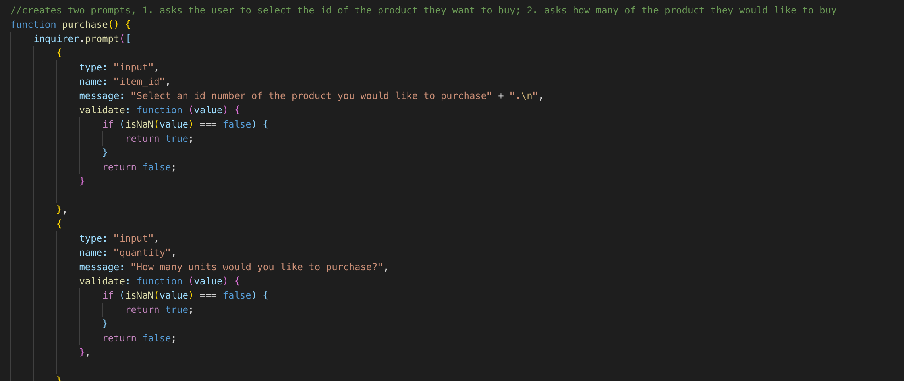

# bamazon

Bamazon Node.js and MySQL application

Here is a link to my Github: https://github.com/Knwhit20/bamazon

In this activity, you'll be creating an Amazon-like storefront with the MySQL skills you learned this unit. The app will take in orders from customers and deplete stock from the store's inventory. 

Project Instructions
1. Create a MySQL Database called `bamazon`.

2. Then create a Table inside of that database called `products`.

3. The products table should have each of the following columns:

   * item_id (unique id for each product)

   * product_name (Name of product)

   * department_name

   * price (cost to customer)

   * stock_quantity (how much of the product is available in stores)

4. Populate this database with around 10 different products. (i.e. Insert "mock" data rows into this database and table).

5. Then create a Node application called `bamazonCustomer.js`. Running this application will first display all of the items available for sale. Include the ids, names, and prices of products for sale.

6. The app should then prompt users with two messages.

   * The first should ask them the ID of the product they would like to buy.
   * The second message should ask how many units of the product they would like to buy.

7. Once the customer has placed the order, your application should check if your store has enough of the product to meet the customer's request.

   * If not, the app should log a phrase like `Insufficient quantity!`, and then prevent the order from going through.

8. However, if your store _does_ have enough of the product, you should fulfill the customer's order.
   * This means updating the SQL database to reflect the remaining quantity.
   * Once the update goes through, show the customer the total cost of their purchase.

Technologies Used:
Node.Js
MySQL Workbench

Connect Node.js with MySQL database

Product Display of all items available for sale. Includes id, name, department, price and quantity

Purchase item demo: id=10, 1000 staplers purchased

Inventory updated: Stapler quantity updated after 1000 staplers purchased

Insufficient quantity demo

Switch statements:

Logic: Confirm enough stock exists to fulfill order. If stock exists, the order is filled, total price provided to user and stock quantity updated.  If not enough of product is available, message to the console "not enough exists"

Start over function: the user is prompted if they would like to continue shopping, if they select yes, then the function startover is called

End program 

